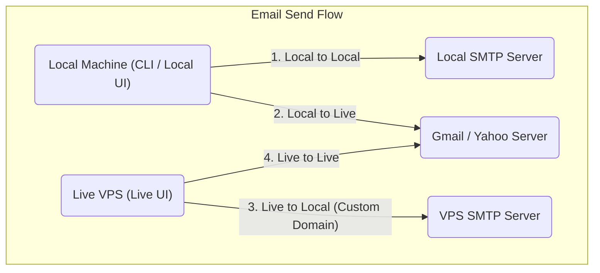
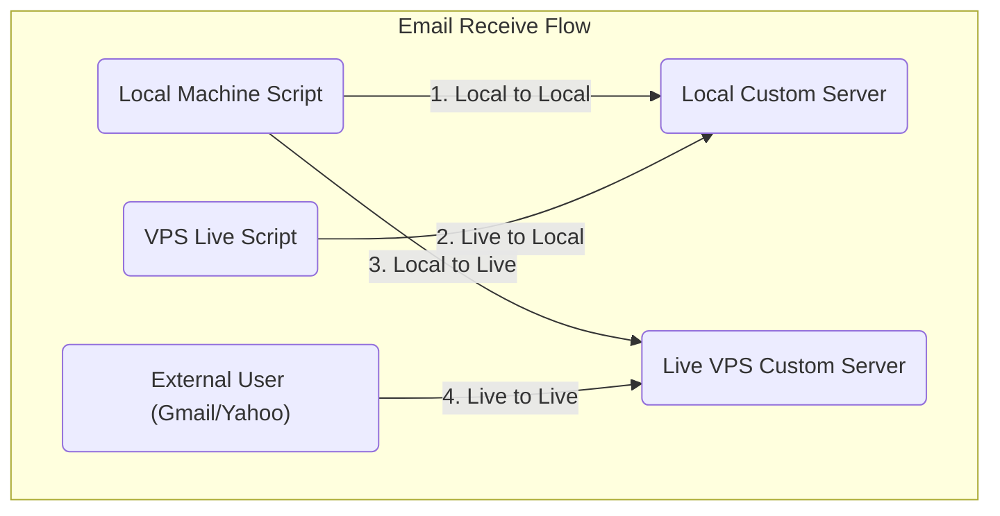

# Temp Email System (Custom Email Server)

Yeh ek custom email server application hai jo aapko apni custom domain (jaise `llamerada.online`) par emails bhejney aur wasool (receive) karne ki poori saholat deti hai. Yeh system **Local development** aur **Live VPS** dono environments mein theek tarah se kaam karne ke liye design kiya gaya hai.

## 🚀 Features (Khusoosiyat)

- **Send Emails:** Aap kisi bhi public email address (Gmail, Yahoo) ya custom domain par email bhej sakte hain.
- **Receive Emails:** Apni custom domain par aane wali tamam emails ko live receive aur read kar sakte hain.
- **4-Way Email Flow:**
  - `Local to Local`
  - `Local to Live`
  - `Live to Local`
  - `Live to Live`
- **Direct IP Sending/Receiving:** Baghair domain ke direct IP address (e.g. `user@[64.227.137.95]`) use kar ke bhi email send ya receive ki ja sakti hai.
- **Spam Prevention:** SPF aur DMARC records ke zariye emails ko spam mein jane se bachane ka mukammal intezam.

---

## 📚 Documentation & Guides
Is project ke har hisse ko tafseel se samajhne ke liye alag alag guides banayi gayi hain taake naye developers ko asani ho. Aap neechay diye gaye links par click kar ke unhe parh sakte hain:

1. 📖 **[VPS Setup Guide](./doc-flow/vps-setup.md)**
   - Naye VPS par Node.js, PM2 install karne aur is project ko live karne ka poora tariqa.
2. 🛡️ **[Spam Prevention Guide](./doc-flow/spam-prevention-guide.md)**
   - Emails ko reject ya spam hone se bachane ke liye SPF aur DMARC records lagane ka tariqa.
3. 📤 **[Send Email Flow](./doc-flow/send-mail-flow.md)**
   - Email bhejne ka mukammal flow, zaroori packages, port requirements, aur mukhtalif scenarios.
4. 📥 **[Receive Email Flow](./doc-flow/receive-mail-flow.md)**
   - Email receive karne ka flow, DNS (A aur MX) records, aur zaroori packages ki tafseel.
5. 🌐 **[Protocols & DNS Records Guide](./doc-flow/protocols.md)**
   - Tamam zaroori protocols (A, MX, TXT, SPF, DMARC, DKIM, SMTP) ki mukammal tafseel aur unhe implement karne ka tariqa.
6. 🔌 **[Outbound SMTP Server Guide (on-smtp)](./doc-flow/on-smtp-flow.md)**
   - Kisi bhi naye project (e.g., PHP, Node.js) mein is mail server ko attach karne ka tariqa, credentials, aur Port 2525 connection flow.

---

## 📊 Flow Diagrams (System Kaise Kaam Karta Hai)

Neechay diye gaye diagrams mein Email Send aur Receive karne ke tamam flows wazeh kiye gaye hain.

### 📤 1. Email Sending Flow Diagram


### 📥 2. Email Receiving Flow Diagram


---

## 🛠️ Quick Start (Run Kaise Karein?)

Agar aap is project ko apne paas run karna chahte hain toh yeh commands chalayen:

```bash
# 1. Packages install karein
npm install

# 2. Frontend Astro app ko build karein
npm run build

# 3. Email Server aur Backend API start karein
npm run mail:start
```
