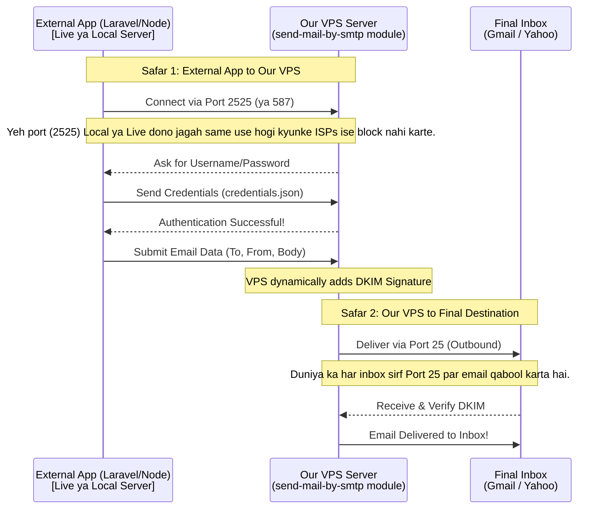

# Outbound SMTP Server Flow (send-mail-by-smtp)

Yeh document `send-mail-by-smtp` folder mein majood **Custom Outbound SMTP Server** ka maqsad aur kaam karne ka tariqa (flow) bayan karta hai.

## 🎯 Maqsad (Why we created this?)
Pehle hum emails bhejne ke liye apne custom UI (Live Console) ka istemal kar rahe thay. Lakin agar koi user is poore setup ko as a "Module" kisi aur project (jaise Laravel, Node.js, Next.js) mein lagana chahe, toh usay ek proper SMTP server chahiye hoga jahan wo apni emails hand-over kar sake. 

Is maqsad ke liye humne `send-mail-by-smtp/smtp-server.js` banaya hai jo **Port 2525** par chalta hai aur Username/Password ke zariye authenticate karta hai. Yeh bilkul **SendGrid** ya **Amazon SES** ki tarah kaam karta hai.

## 📂 Folder Structure (is folder mein kya hai?)
1. **`smtp-server.js`**: Yeh hamara mukhya (main) server hai jo Port 2525 par chalta hai aur emails receive karke authenticate karta hai.
2. **`credentials.json`**: Isme username aur passwords mehfooz hote hain jo hum external apps ko dete hain taake wo is server se connect ho sakein.

---

## 🔄 Flow (Yeh kaam kaise karta hai?)

Neechay diye gaye flowchart se aap iska poora safar samajh sakte hain:



Email bhejte waqt do (2) safar (legs) hote hain:

### 1. Client to Our VPS (Safar 1)
* **Client App:** User apni application (e.g. PHP/Node.js) mein `Nodemailer` ya kisi aur SMTP client ko configure karta hai.
* **Credentials:** Wo hamare server ka Host, Port (2525), aur Username/Password (`send-mail-by-smtp/credentials.json` mein diye gaye) dalta hai.
* **Connection:** Client app hamare VPS par Port 2525 ke zariye connect hoti hai. Hamara server password verify karta hai aur email ko qabool (accept) kar leta hai.

### 2. Our VPS to Destination (Safar 2)
* **Parsing:** Jab email milti hai, toh `smtp-server.js` usay parse (read) karta hai taake To, From, Subject, aur Attachments nikal sake.
* **DKIM Signing:** Phir yeh hamare pehle se bane huye function `sendOutboundEmail` ko call karta hai, jo is email par hamari domain ka **DKIM Signature** lagata hai taake email spam mein na jaye.
* **Delivery:** Aakhir mein, hamara VPS us email ko aagay (Google/Yahoo) ke Port 25 par forward kar deta hai.

---

## 🔌 Kisi bhi Project mein Kaise Connect Karein?

Agar aapne isay kisi bhi naye project mein use karna hai, toh aap apne `.env` file mein yeh details dalenge:

```env
SMTP_HOST=mail.llamerada.online  (ya aapke VPS ka IP)
SMTP_PORT=2525
SMTP_USER=developer
SMTP_PASS=secretpassword123
```

**Node.js (Nodemailer) Example:**
```javascript
const nodemailer = require('nodemailer');

const transporter = nodemailer.createTransport({
  host: 'mail.llamerada.online',
  port: 2525,
  secure: false, // Port 2525 uses STARTTLS
  auth: {
    user: 'developer',
    pass: 'secretpassword123'
  }
});

transporter.sendMail({
  from: '"My App" <abc@llamerada.online>',
  to: 'hasanameer386@gmail.com',
  subject: 'Test from Custom SMTP Relay',
  text: 'This email was routed through our custom send-mail-by-smtp server!'
});
```

---

## ⚠️ DigitalOcean Port 25 Issue
Jaise ke humein pata hai ke dunya ka har mail server (Gmail/Yahoo) aane wali emails **Port 25** par hi qabool karta hai. 

* Jab aapki app hamare VPS ko email degi (Safar 1), toh **Port 2525** use hoga jo ke hamesha khula hota hai (No issues).
* Lakin jab hamara VPS usay Gmail tak deliver karega (Safar 2), toh hamare VPS ko aagay **Port 25** use karna hoga. Agar DigitalOcean ne Port 25 outbound block kiya hua hai, toh email Safar 2 mein fail ho jayegi.
* Iska ek hi hal hai ke DigitalOcean support se baat kar ke Port 25 unblock karwaya jaye. Jab tak unblock nahi hota, Local-to-Local emails bheji ja sakti hain.

### 💡 Alternative VPS Providers (Jo Port 25 allow karte hain)
Agar aap DigitalOcean par Port 25 unblock nahi karwa pa rahe, toh aap in VPS providers ka istemal kar sakte hain jo aam taur par Port 25 khula rakhte hain:
1. **Contabo:** Sasta aur behtareen hai, by default Port 25 block nahi hota (ya asani se support par ticket khol kar unblock ho jata hai).
2. **Hostinger VPS:** Inki policy bhi email servers ke hawale se behtar hai.
3. **Linode / Vultr:** Inmein bhi ticket open karke Port 25 asani se unblock karwaya ja sakta hai.

### 🎯 Port 25 vs Port 2525
* **Port 25 (Server-to-Server):** Isay sirf Server se Server (MTA to MTA) baat karne ke liye rakha gaya hai (jaise Gmail hamare VPS ko email bhejta hai). Ismein Authentication nahi lagti.
* **Port 587 ya 2525 (Client-to-Server):** Isay Message Submission Port kaha jata hai. Yeh sirf is kaam ke liye banaya gaya hai ke ek insaan ya app (client) apne server ko authentication (username/password) de kar email pakra (hand-over kar) sake.
